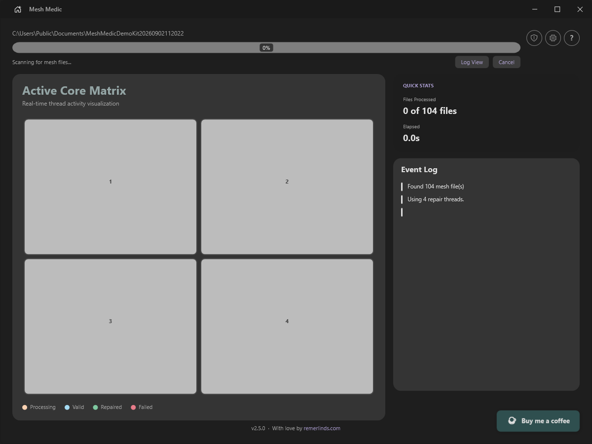
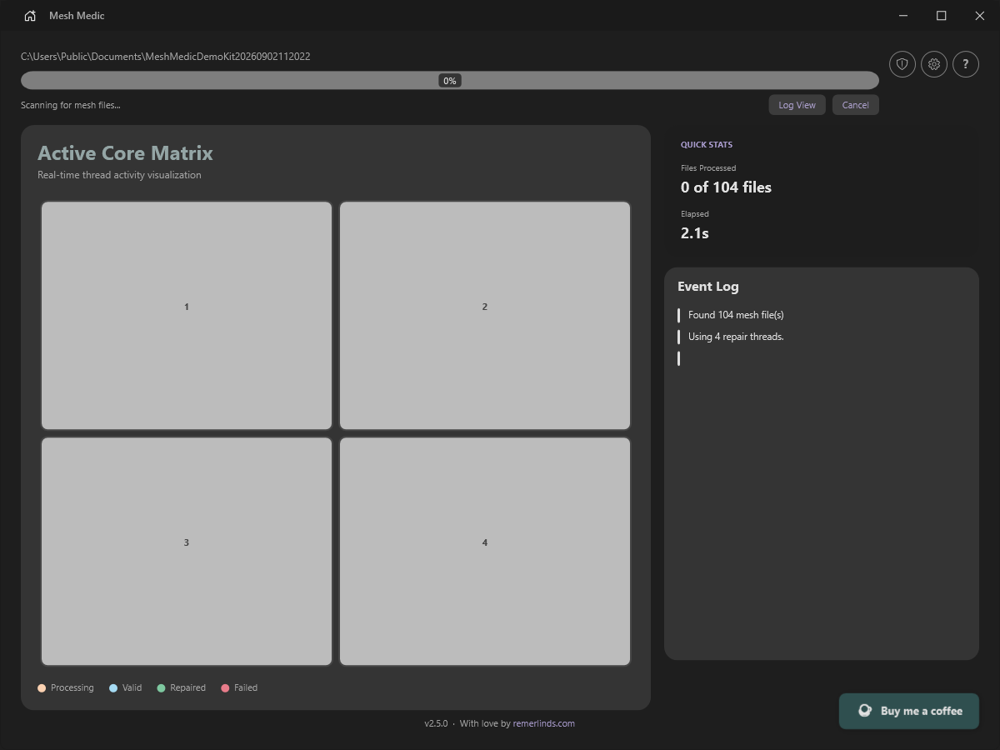
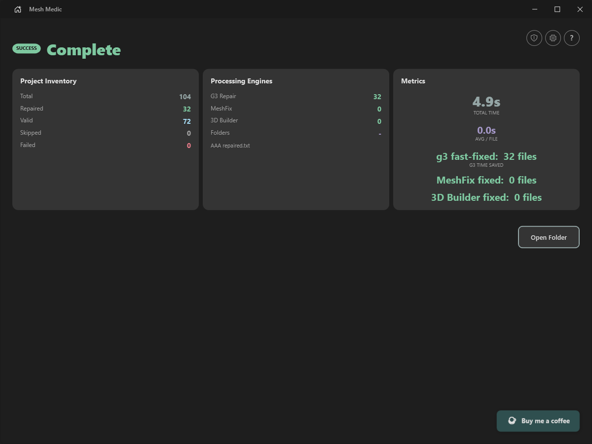

# Mesh Medic

**Check a whole STL or OBJ kit before one bad mesh reaches your slicer.**

[](https://github.com/RemindZ/Mesh-Medic-Releases/releases/tag/v2.5.0)
[](https://github.com/RemindZ/Mesh-Medic-Releases/releases/tag/v2.5.0)
[](#formats-and-output)
[](LICENSE)

> **[Download Mesh Medic v2.5.0 for Windows](https://github.com/RemindZ/Mesh-Medic-Releases/releases/download/v2.5.0/MeshMedic-v2.5.0.zip)**
>
> The link above downloads the Mesh Medic app—not the separate MeshFix engine release. No installer or account required.

## Watch it work

https://github.com/user-attachments/assets/d4298bee-1cb9-434a-b4a3-01df7c018cba

*Watch with sound. 48.8 seconds of genuine Mesh Medic v2.5 footage using a labelled synthetic STL run.*

A slicer warning can turn a downloaded kit into a file-by-file loop: open, check, repair,
save, repeat. Mesh Medic makes that one visible Windows batch. Point it at a folder and it
scans every STL and OBJ below it, leaves healthy files alone in Automatic mode, and sends
damaged meshes through a validated repair path.

## From folder to result

1. **Drop in a kit.** Choose a folder or drag it into the app; subfolders are included.
2. **Scan once.** Automatic mode separates healthy meshes from the files that need work.
3. **Repair without the loop.** Start the batch and see active workers as the app processes
   the damaged files.
4. **Review every outcome.** The completion view shows what was valid, repaired, skipped,
   or still needs attention.

<p align="center">
  
  
  
</p>

## Why use it?

- **Batch triage for miniature kits.** Check whole STL and OBJ folders instead of opening
  every model in 3D Builder.
- **Healthy files stay healthy.** In Automatic mode, valid meshes are left untouched.
- **Visible work, not a black box.** Follow the live worker view and review the final status
  for every file.
- **Built for real folders.** Use configurable parallel workers, with scale-aware tolerances
  derived from each mesh rather than one fixed unit assumption.

## Repair engines

Mesh Medic v2.5.0 uses a progressive path: **geometry3Sharp → MeshFix → Windows 3D Builder
Quick Fix → Windows 3D Builder Full Fix**. It stops at the first verified result, so the
heavier fallbacks are only used when earlier work does not pass.

[MeshFix 2.1](https://github.com/RemindZ/Mesh-Medic-Releases/releases/tag/meshfix-2.1) is an
optional GPL-3 engine by Marco Attene / IMATI-GE-CNR, downloaded separately on first use.
Mesh Medic checks its pinned SHA-256 before running it as a separate process. If MeshFix
is unavailable, the app continues to the Windows fallbacks. The engine release includes
its binary, checksum, corresponding source, and license; downloading it alone does not
install Mesh Medic.

## New in v2.5

- **Another chance to repair difficult files.** MeshFix runs between g3 and the Windows
  fallbacks, with component-preservation checks and reported removal of eligible tiny debris.
- **In-app updates.** Download a newer app version from the update prompt. The updater
  verifies the ZIP against its published SHA-256 before replacement.
- **Visible engine availability.** Check MeshFix status and access its install, source,
  and license links from the home screen.

See the [v2.5.0 changelog](https://github.com/RemindZ/Mesh-Medic-Releases/releases/tag/v2.5.0)
for details and limitations. Engine totals can show zero after a resumed batch; check the
per-file repair status for outcomes.

## Repairs have to pass before they count

Mesh Medic does not treat an engine exit code as proof of a good result.

- Each engine writes to a uniquely named staging file.
- A candidate is validated before it can replace the original.
- In-place repair creates a `.backup` first; a failure or cancellation restores it.
- Converted output never silently overwrites an existing destination.
- If a batch is interrupted, the next launch can resume it.

## Formats and output

| Input | Automatic output | Forced output |
|---|---|---|
| STL | Keeps STL | STL or sibling OBJ |
| OBJ | Keeps OBJ | OBJ or sibling STL |

Mesh Medic reads binary and ASCII STL. For OBJ, it preserves material libraries, material
scopes, object/group/smoothing scopes, and relative texture sidecars where the repaired
topology allows it. **Caveat:** rebuilding topology can lose exact UV references, so review
OBJ results before relying on their texture mapping.

## Quick start

1. Download and extract [Mesh Medic v2.5.0](https://github.com/RemindZ/Mesh-Medic-Releases/releases/download/v2.5.0/MeshMedic-v2.5.0.zip).
2. Run `MeshMedic.exe` and choose or drop a folder.
3. Keep **Output format** on Automatic unless you deliberately want sibling conversions.
4. Start the batch, then review the completion screen.

Install Microsoft 3D Builder for the Windows repair fallbacks. The v2.5.0 app checks for it
on startup. See the [app release page](https://github.com/RemindZ/Mesh-Medic-Releases/releases/tag/v2.5.0)
for download and setup information.

## Command line

```powershell
MeshMedic "C:\My Models\Miniature Kit"
MeshMedic "C:\Models" --output-format obj
```

`--output-format` accepts `auto`, `stl`, or `obj`. The in-app PATH installer lets you call
`MeshMedic` from any terminal.

## Requirements

- Windows 10 build 19041 or newer
- x64 processor
- Microsoft 3D Builder for the final repair fallbacks
- .NET 8 runtime, bundled in the release

## Languages and themes

Mesh Medic has three visual themes (Remerlinds, Bird, and Henchman), each with light and dark
modes. The interface detects your system language and supports English, German, French,
Spanish, Italian, Brazilian Portuguese, Japanese, Korean, and Simplified Chinese.

## Privacy

Mesh Medic does not send model names, file paths, or arbitrary exception text in diagnostic
payloads. Crash metadata is sent only after you opt in. Feedback contains only the text you
choose to submit. Basic usage counting sends a persistent random client ID and app version;
Cloudflare receives the source IP for rate limiting.

## Security and availability

Mesh Medic releases are unsigned. Windows SmartScreen or antivirus software may warn before
the app runs. The v2.5.0 release page is the authoritative app download and publishes the
ZIP and its SHA-256 checksum. The checksum verifies download integrity; it is not a digital
signature or an antivirus verdict. The ZIP contains the obfuscated application executable,
not private source code, and is not password-encrypted.

## Feedback

Use the shield button in the app to send a bug report, feature request, or confusing workflow.
Please include only information you are comfortable sharing.

---

*With love by [remerlinds.com](https://remerlinds.com)*
